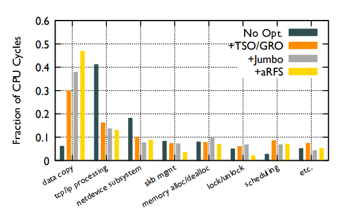

# Рецензия на статью "Understanding Host Network Stack Overheads"

### Выполнил Корняков Санан Арсланович

## Описание

Статья представляет собой многочисленные измерения производительности, скорости, задержек и кэш-миссов, и выводы на их основе. Главной темой является сетевой ботлнек в современном мире, где пропускная способность каналов достигает сотен гигабит.

## Оригинальность

Хотя на первый взгляд тесты системы и выводы могут показаться недостаточно оригинальными, детальные указания ботлнеков и возможностей улучшения позволяют глубже понять проблемные места в текущем сетевом стеке. Например, они по частям разбили действия процессора и замерили его использование с разными видами оптимизаций.

Они не просто нарисовали непонятный график, а по полочкам расписали какие оптимизации на что повлияли, причём это сделано для каждого нарисованного графика.

Я позволю себе предположить, что эта статья не повторяет предыдущие 43 (я же не больной читать 43 статьи), так как статья полностью состоит из собственных экспериментов.

Методы не являются оригинальными, простые замеры нагрузок, производительности, миссов и т.д.

## Качество

Авторы хорошо погружены в сетевой стек линукса и устройство процессоров, что позволяет им проводить точечные эксперименты и делать чёткие выводы с описанием задействованных компонентов (железа или программ).

> When the sender-side application executes a write
system call, the kernel initializes socket buffers (skbs) ...
skbs are segmented into Maximum Transmission Unit (MTU) sized
chunks by Generic Segmentation offload (GSO) and are enqueued
in the NIC driver Tx queue(s). Most commodity NICs also support
hardware offload of packet segmentation, referred to as TCP segmentation offload (TSO) ... . Finally, the driver
processes the Tx queue(s), creating the necessary mappings for the
NIC to DMA the data from the kernel buffer referenced by skbs.
Importantly, almost all sender-side processing in today’s Linux
network stack is performed at the same core as the application.

Каждый свой вывод они подкрепляют экспериментами и техническими знаниями. Например, для подсчёта производительности пайплайна отправителя, они провели несколько экспериментов с разными видами оптимизаци и количеством ядер, доказав их теорией с L3 кэшами и NUMA нодами.

Используемые методы одекватны, так как цель работы - анализ текущих ботлнеков современного сетевого стека, хотя есть одно допущение, которое ставит под сомнение результаты работы. Все эксперименты проводились с двумя нодами, подключенными напрямую сетевым кабелем, без свичей и маршрутизаторов. То есть, задержки сети, дроп пакетов, флапы сети и другие проблемы настоящей сети не присутствовали в экспериментах, что могло вызвать синтетические результаты, не связанные с реальным миром.

## Ясность

Статья представляет собой сухой технический текст с порой ненужными деталями в виде технологий и их аббревиатур. Сравнивая её, например с RFC, можно увидеть, что бесконечные повторения NIC, DMA, NUMA и других слов, подкрепленные одинаковыми экспериментами, вызывают желание пропустить всё мимо ушей и просто прочитать заключение.

Наверно, опытному читателю хорошо знакомому с темой статьи такая подача может понравится и помочь воспроизвести результаты экспериментов, однако для среднестатестического программиста эта статья может показаться занудной и бесполезной. Думаю, можно было точечно опускаться в детали работы сетевого стека по мере необходимости, не повторяясь в других экспериментах.

## Значимость

Результаты статьи подсвечивает важную тему лучшей оптимизации хостов по мере увеличения пропускной способности сети. Она поможет мейнтейнерам линукса и другим сетевикам направить силы на улучшения пайплайна общения по сети, и так как в статье чётко описаны технологии и механизмы, требующие доработки, то им не придётся проводить собственный анализ ботлнеков.
